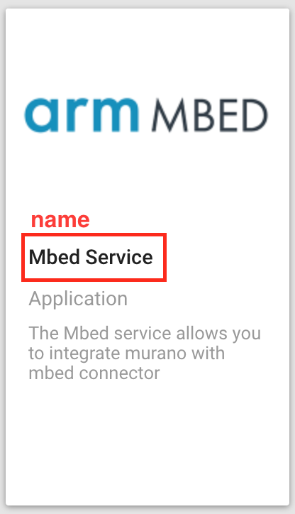

---

---

<h1 id="murano-exchange-elements">Murano Exchange Elements</h1>

Elements defined here are owned by the Exosite business and Exchange user:

BIZID: aeqnqiymw87zxgvi
EMAIL: <a href="mailto:exchange@exosite.com">exchange@exosite.com</a>
They populate the public storefront with baseline offerings, including internal services normally granted to all solutions.

Open a PR against the master branch if updates are needed.

<h2 id="make-a-service-type-exchange-element">Make a service type Exchange Element</h2>
<h3 id="files-structure">Files structure</h3>

In the elements folder, contain all of the elements that we have. You need to create a folder, name it <code>service-&lt;service name&gt;</code>. In the folder create  a <code>service-&lt;service name&gt;.md</code> file and a <code>service-&lt;service name&gt;.json</code> file and a detail image and a thumbnail imgae for this service.  like this,

<ul>
<li>elements
<ul>
<li>service-mbed
<ul>
<li>mbed_detail.png</li>
<li>mbed_thumbnail.png</li>
<li>service-mbed_serivce.json</li>
<li>service-mbed_serivce.md</li>
</ul>
</li>
</ul>
</li>
</ul>
<h3 id="definition">Definition</h3>

When updating the markdown (.md) file, please have a look at a couple of other existing services (e.g., SPMS, Twilio, etc.) for formatting and content guidelines.

<h3 id="json-file">*.json File</h3>

<a href="https://docs.google.com/document/d/1VlFmkiNcBK9AX6BpgV-E_5EDGgt0K_L5exJcgv6gEDQ/edit#heading=h.l6fiheqnpa08">bizapi document</a>

<ul>
<li>
<h4 id="type">type</h4>
Only can be <code>application</code> right now. When calling bizapi, it only allows <code>application</code> type. After exchange element created, you need change type to <code>service</code> from MongoDB or use <a href="https://github.com/exosite/dqa-env/tree/master/bin/exchange-element-tool">exchange-element-tool</a> to update it.</li>
<li>
<h4 id="name">name</h4>
Name would display in these areas:</li>
</ul>

- #### image
	For the Thumbnail and Details page images, please create a ticket with the name/s of the elements to be created and add the label uxd-required. Then every Monday morning Nick backlog groom and plan that week's (one week long) sprint and as much of the following as we know.
Marking it as a blocker/major or giving it a due date will help expedite!!  
	Once you have images, adding the file name to the JSON.  The UI does the differentiating between thumbnail and main image for you.
<pre><code>- thumbnail - thumbnail is a small image show in exchange element card. Update the filename to same as the images you want to upload. When running  [exchange-element-tool] will update the url part for bizapi, it won't change this `.josn` file. When you want call bizapi manually, you need to change url path which image at cloud.
&lt;img src="./readme_resources/thumbnail.png" width="213"&gt;

- detail - detail is a large image show in exchange element detail page.  Update the filename to same as the images you want to upload. When running  [exchange-element-tool] will update the url part for bizapi, it won't change this `.josn` file. When you want call bizapi manually, you need to change url path which image at cloud.
&lt;img src="./readme_resources/detail.png" width="600"&gt;	
</code></pre>
<ul>
<li>
<h4 id="description">description</h4>
</li>
</ul>

<ul>
<li>
<h4 id="tags">tags</h4>
You can add tags as desired.  In the new details layout, these tags will not be displayed, but will later be leveraged for sorting, filtering, searching.</li>
<li>
<h4 id="markdown">markdown</h4>
When using <a href="https://github.com/exosite/dqa-env/tree/master/bin/exchange-element-tool">exchange-element-tool</a>, it will stringify the md file and attach string to here. See <a href="#md-file">*.md file</a>.</li>
<li>
<h4 id="source">source</h4>
Since this is a service, you can just copy/paste exactly what any of the other services have for actions. The URL property is ignored for this element type but the full action’s shape is required.  Here is what you’ll use:
“actions”: [
“url”: “<a href="https://raw.githubusercontent.com/exosite-garage/">https://raw.githubusercontent.com/exosite-garage/</a>…”,
“type”: “service”,
“primary”: true
]</li>
<li>
<h4 id="tiers">tiers</h4>
<strong><em>IMPORTANT!</em></strong> – You’ll need to populate the <code>tiers</code> array or the element will not appear on the Exchange.  You’ll want to list all of the tiers that this service can be accessed at.  So if it’s available for everyone then tiers: <code>[ "free", "developer", "professional", "enterprise"]</code>. If just professional or higher tiers: <code>["professional", "enterprise"]</code>, and so on.</li>
</ul>
<h3 id="md-file">*.md File</h3>

