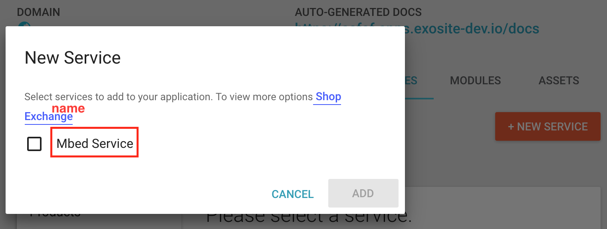

# Murano Exchange Elements
Elements defined here are owned by the Exosite business and Exchange user:

BIZID: aeqnqiymw87zxgvi
EMAIL: exchange@exosite.com
They populate the public storefront with baseline offerings, including internal services normally granted to all solutions.

Open a PR against the master branch if updates are needed.


----------


## Create Exchange Element definition files

### Files structure
In the elements folder, contain all of the elements that we have. You need to create a folder, name it `service-<service name>`. In the folder create  a `service-<service name>.md` file and a `service-<service name>.json` file and a detail image and a thumbnail image for this service.  like this,
- elements
	- service-mbed
		- mbed_detail.png
		- mbed_thumbnail.png
		- service-mbed_serivce.json
		- service-mbed_serivce.md
		     
When updating the markdown (.md) file and json file, please have a look at a couple of other existing services (e.g., SPMS, Twilio, etc.) for formatting and content guidelines.

### *.json File definition
This json file is base on [bizapi document](https://docs.google.com/document/d/1VlFmkiNcBK9AX6BpgV-E_5EDGgt0K_L5exJcgv6gEDQ/edit#heading=h.l6fiheqnpa08).
- #### type 
	Only can be `application` right now. When calling bizapi - `PUT /exchange/{bizid}/element/{elementId}
`, it only allows `application` type. After exchange element created, you need change type to `service` from MongoDB or use [exchange-element-tool] to update it.
- #### name
	Name would display in these areas:  
	
	  
	Go to solutions then choose your applications at services tab then click *+NEW SERVICES*
	
- #### image
	For the Thumbnail and Details page images, please create a ticket with the name/s of the elements to be created and add the label uxd-required. Then every Monday morning Nick backlog groom and plan that week's (one week long) sprint and as much of the following as we know.
Marking it as a blocker/major or giving it a due date will help expedite!!  
	Once you have images, adding the file name to the JSON.  The UI does the differentiating between thumbnail and main image for you.
	- thumbnail - thumbnail is a small image show in exchange element card. Update the filename to same as the images you want to upload. When running  [exchange-element-tool] will update the url part for bizapi, it won't change this `.josn` file. When you want call bizapi manually, you need to change url path which image at cloud.  
	  
	- detail - detail is a large image show in exchange element detail page.  Update the filename to same as the images you want to upload. When running  [exchange-element-tool] will update the url part for bizapi, it won't change this `.josn` file. When you want call bizapi manually, you need to change url path which image on the cloud.  
	  
- #### description
	
	  
- #### tags
	You can add tags as desired.  In the new details layout, these tags will not be displayed, but will later be leveraged for sorting, filtering, searching.
- #### markdown
	When using [exchange-element-tool], it will stringify the md file and attach string to here. See [*.md file](#md-file).
- #### source
	- from:  "service"
	- name: the service alias. At [Pegasus Registry](https://github.com/exosite/pegasus_registry/tree/master/services), you can see many yaml files. Pegasus will create a service by yaml file's name.
	- schema: for “from=service”: the swagger schema in yaml format. It's not workable now, depends on [MUR-3824](https://jira.exosite.com/browse/MUR-3824). Once it's done, we can create a service as creating exchange element. So remove the attr for now.  
	
- #### tiers
	***IMPORTANT!*** – Bizapi doesn't support tiers when calling API, but it will create a empty array in MongoDB. 
	You'll need to populate the `tiers` array or the element will not appear on the Exchange.  You'll want to list all of the tiers that this service can be accessed at.  So if it's available for everyone then tiers: `["free", "developer", "professional", "enterprise"]`. If just professional or higher tiers: `["professional", "enterprise"]`, and so on.  You can use [exchange-element-tool] by running `node index.js --public  <elementId>` to publish an exchange element or modify MongoDB directly.
	
	
### *.md File definition
- #### description
	The first line is a title, it contains exchange element's name and service type image. It doesn't show at anywhere for now but still should give it a name.
	After the first line is a description, it supports markdown format. You can provide further information than the [description](#description) in json file.
	```
	# Mbed Service 

	The Mbed service allows you to integrate murano with mbed connector.
	```
- #### documentation
	Documentation is optional, but better have.
	```
	Documentation:

	[Mbed Service Documentation](http://docs.exosite.com/reference/services/mbed/)

	[Mbed Service Quickstart Guide](https://support.exosite.com/hc/en-us/articles/115004946503)
	```
	


----------
The readme only include create exchange element definition files, about how to publish a service as an exchange element please read this [wiki](https://wiki.exosite.com/display/ENG/How+to+publish+a+service+as+Exchange+Element).

 [exchange-element-tool]:https://github.com/exosite/dqa-env/tree/master/bin/exchange-element-tool
